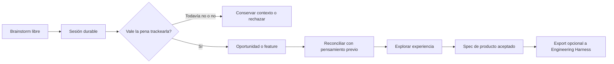
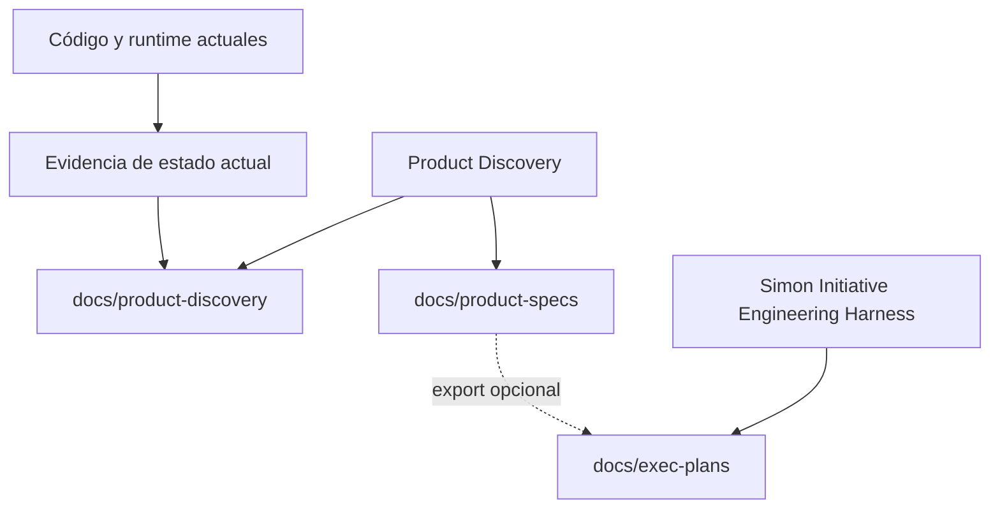

# Product Discovery Harness

[English](README.md) · **Español**

Product Discovery Harness convierte pensamiento de producto desordenado en decisiones durables y conectadas. Podés brainstormear libremente con un agente; las partes importantes quedan en el repo target como sesiones, oportunidades, features, decisiones, specs y evidencia.

Sirve para responder: *¿qué queremos construir?, ¿para quién?, ¿qué ya decidimos?, ¿nos estamos repitiendo o contradiciendo?* Podés cambiar de opinión: el harness ayuda a dejar claro qué cambió, qué se solapa, qué se rechazó y por qué.

> **Complemento recomendado:** usa este harness para definir **qué** y **por qué** construir. Cuando una feature esté lista, usa el [Simon Initiative Engineering Harness](https://github.com/Simon-Initiative/harness) para analizar, diseñar, planificar, implementar y verificar **cómo** construirla. Es opcional: este repositorio nunca lo requiere ni lo modifica.

## Primero: skills versus comandos

`$product-*` son **skills conversacionales** que se invocan con el agente dentro del repo target. No son comandos de shell. `product-harness ...` son comandos locales deterministas.

```text
# Pedir al agente
$product-talk
$product-reconcile <record-id>

# Ejecutar en terminal
product-harness landscape .
product-harness validate .
```

## Modelo mental



No hay IDs `IDEA-*`: las ideas tempranas viven en sesiones. Se promueven solo si merecen atención durable: **OPP** para situación/problema/outcome, **FEATURE** para dirección concreta aceptada, **DEC** para una decisión explícita y **CURRENT** para evidencia de lo que existe hoy.



El código describe comportamiento actual; los docs aceptados describen intención futura. Si difieren, hay una discrepancia para reconciliar.

## Instalalo una vez; usalo en muchos repositorios

La instalación deja un checkout Git del harness en tu máquina y enlaza sus
skills al directorio de skills de tu agente. No copia el harness dentro de cada
repo de producto.

```bash
curl -fsSL https://raw.githubusercontent.com/nicocirio/product-discovery-harness/main/install.sh | bash
```

Instala el canal etiquetado `stable` en
`~/.local/share/product-discovery-harness`, enlaza las skills bajo un namespace
propio `product-discovery-harness` en `~/.agents/skills` y/o
`~/.claude/skills`, y deja disponible el CLI local `product-harness`.

Usá `latest` solo si querés la rama principal en lugar del tag más reciente:

```bash
curl -fsSL https://raw.githubusercontent.com/nicocirio/product-discovery-harness/main/install.sh | bash -s -- latest
```

Desde un checkout local, ejecutá `./bin/product-harness-install latest`.

```bash
./bin/product-harness-update       # trae el canal elegido y repara links
./bin/product-harness-status       # checkout, canal, versión y links rotos
```

Requiere Git, Bash, Python 3.10+ y red en la primera instalación para crear el
runtime Python local. Podés usar `PRODUCT_HARNESS_REPO_URL` o
`PRODUCT_HARNESS_REPO_PATH` para un fork o checkout propio. Para desinstalar,
eliminá solo el namespace marcado `.product-harness-install-root` y,
opcionalmente, el checkout.

## Publicar una nueva versión del harness (maintainers)

Por ahora los releases son manuales. Desde un checkout limpio y revisado de
`main`:

```bash
make test
make validate
git diff --check
# Actualizá version.json, pyproject.toml y CHANGELOG.md para vX.Y.Z.
git add version.json pyproject.toml CHANGELOG.md
git commit -m "Release vX.Y.Z"
git tag -a vX.Y.Z -m "Release vX.Y.Z"
git push origin main --follow-tags
```

No crees el tag si falla una puerta. `stable` instala el tag de release más
reciente; `latest` sigue la rama principal y sirve para quien deliberadamente
quiere cambios sin tag. Cuando el repositorio sea público, agregá el smoke test
remoto anotado en el tracker de deuda técnica.

## Bootstrap en cada repo target

Después de instalar una vez, entrá al repositorio donde querés definir producto:

```text
$product-bootstrap --mode=auto
$product-talk
```

Bootstrap crea el contexto durable de discovery del target. No instala skills,
no modifica código de aplicación ni requiere Engineering Harness.

## Empezá por acá: contale al harness qué tenés en mente

No necesitás elegir la skill correcta antes de empezar. Usá `$product-talk` y
describí la situación con lenguaje común. El facilitador aclara el problema,
guarda una sesión concisa y recomienda el próximo foco útil cuando se vuelve
claro. Nunca promueve una idea ni toma una decisión de producto en silencio.

Las skills especializadas están para cuando querés profundizar. No son una
checklist obligatoria.

## Tus primeros diez minutos

### Producto nuevo

```text
$product-bootstrap --mode=greenfield
$product-talk
```

El facilitador lee el contexto, hace una pregunta útil y ayuda a decidir qué
merece atención durable. Por ejemplo: “¿Qué situación o motivación te llevó a
querer que este producto exista?”

### Producto existente

```text
$product-bootstrap --mode=brownfield
$product-audit
$product-review-current-state
$product-talk
```

Audit reconstruye evidencia provisional. Actualiza `current-state/` y conserva
cada ejecución en `docs/product-discovery/audits/`; revisá la última evidencia
con el owner antes de tratarla como baseline aceptado.

## Ejemplo completo: reservas de turnos

Imaginá que manejás una peluquería y decís:

```text
$product-talk

“Quiero que los clientes reserven turnos sin escribirnos, y quiero que falten
menos a sus turnos.”
```

El facilitador no debería saltar a una feature. Primero puede preguntar si lo
más importante es reducir mensajes, ausencias o confusión en la agenda. Si
aceptás que un problema merece seguimiento, el harness asigna el código; no lo
inventás vos:

```text
Created opportunity:
OPP-001 — Reduce missed appointments

Next suggested focus: learn when and why appointments are missed.
```

Cuando volvés más adelante, encontrá el registro por título en vez de memorizar
códigos:

```text
$product-landscape

Active opportunities:
- OPP-001 — Reduce missed appointments
  Exploring · Last reviewed: 12 days ago
```

Recién entonces una skill que recibe un ID pasa a ser útil:

```text
$product-opportunity-explore OPP-001
```

> **Sobre los IDs:** el harness asigna los IDs `OPP-*`, `FEATURE-*` y `DEC-*`
> cuando una idea se vuelve un registro durable. Usá `$product-landscape`
> siempre que necesites encontrar uno de nuevo.

## Elegí la profundidad según la decisión

No hay un pipeline obligatorio. Empezá con `$product-talk`; seguí un camino más
profundo solo cuando la pregunta pendiente lo requiera.

| Si necesitás responder… | El próximo tipo de trabajo es… | Skill especializada, si la querés usar explícitamente |
| --- | --- | --- |
| “¿Qué duele realmente, para quién y con qué frecuencia?” | Entender la oportunidad | `$product-opportunity-explore OPP-001` |
| “Hay varias formas distintas de resolverlo. ¿Cuál elegimos?” | Comparar modelos de interacción | `$product-experience-explore OPP-001`, luego `$product-experience-evaluate OPP-001` |
| “Elegimos una dirección. ¿Qué promesa y límites de producto asumimos?” | Convertirla en feature candidata | `$product-feature-crystallize OPP-001` |
| “Esto ya está claro y es de bajo riesgo.” | Mantener corta la conversación; pedir al facilitador que evalúe si una feature candidata está lista | `$product-talk` |

Para la peluquería, explorar experiencia solo sirve si el modelo de reserva es
una decisión real: el cliente puede elegir un horario libre, pedir uno para que
el negocio confirme, o recibir horarios propuestos. Si eso ya está claro, no
ejecutes exploración solo porque la skill existe.

Volvé con `$product-resume`: lee el contexto local y sugiere la conversación o
skill especializada de mayor impacto.

## Qué significan los archivos

| Si querés saber… | Leé… |
| --- | --- |
| Cómo avanzan las ideas | `docs/product-discovery/PRODUCT_LANDSCAPE.md` |
| Qué se solapa o requiere alineación | `docs/product-discovery/CONSISTENCY_REPORT.md` |
| Qué no está resuelto | `docs/product-discovery/STATUS.md` y `open-questions.md` |
| Qué se decidió o rechazó | `docs/product-discovery/decisions/` |
| Qué feature es canónica | `docs/product-specs/` |
| Qué existe hoy | `docs/product-discovery/current-state/` |
| Qué hace ingeniería | `docs/exec-plans/`, si se usa Engineering Harness |

Product Discovery Harness es dueño de `product-discovery/`, `product-specs/`, `PRODUCT_SENSE.md` y `EXPERIENCE_SENSE.md`. Ingeniería es dueña de `exec-plans/` y los docs técnicos. Solo existe un export opcional y marcado de `informal.md`, que no sobrescribe trabajo de ingeniería sin marca.

## Referencia de skills

Usá esto solo cuando querés control directo. `$product-talk` y
`$product-resume` son los puntos de entrada normales.

| Intención | Skills | Para qué sirven |
| --- | --- | --- |
| Prepararse o retomar | `$product-bootstrap`, `$product-resume`, `$product-landscape` | Crear contexto, volver después de una pausa o encontrar registros durables por título. |
| Pensar sin perder coherencia | `$product-talk`, `$product-focus`, `$product-synthesize`, `$product-reconcile`, `$product-review` | Explorar un tema, profundizarlo, consolidar sesiones, revelar solapamientos o revisar la cartera. |
| Entender un producto existente | `$product-audit`, `$product-review-current-state` | Reconstruir y aceptar un baseline actual antes de proponer cambios. |
| Dar forma a una dirección | `$product-opportunity-map`, `$product-opportunity-explore`, `$product-experience-north`, `$product-experience-explore`, `$product-experience-evaluate`, `$product-feature-crystallize` | Pasar de un outcome a una dirección de experiencia elegida y, recién entonces, una feature candidata. |
| Preparar ejecución | `$product-slice`, `$product-handoff`, `$product-validate` | Definir releases por outcome, escribir el spec canónico y comprobar el contrato. |

Los archivos bajo [`skills/`](skills/) contienen el protocolo completo; la tabla sirve para orientarte.

## Ejemplos de output

Son ilustrativos: IDs, palabras y paths reales vienen del target.

### Conversación facilitada

```text
Entendimiento actual: querés que los clientes reserven sin escribir y que falten menos a los turnos.

Pregunta: ¿qué outcome importa más el próximo mes: menos mensajes, menos ausencias o una agenda en la que el equipo confíe?
```

### Panorama y reconciliación

```text
Product landscape updated:
- Records: 7
- Require review: 2

Needs attention:
- OPP-001 — Reduce missed appointments
  Exploring — Review needed: continue discovery
  Last reviewed: 12 days ago
```

```text
Possible overlap:
- OPP-001 overlaps FEATURE-002
  Rationale: both address how customers confirm and remember appointments.

Question: Should OPP-001 extend FEATURE-002, remain distinct, or replace it?
```

Una idea vieja pide revisión; no se rechaza automáticamente. El agente puede detectar tensión, pero no puede fusionar, superseder, rechazar o aceptar un registro silenciosamente.

### Handoff

```text
Canonical product spec created:
docs/product-specs/guided-attention-queue.md

Engineering export:
Not created. Request --export-engineering when you want compatibility export.
```

El spec canónico funciona sin Engineering Harness. Con export explícito, el siguiente paso sugerido es `$harness-analyze docs/exec-plans/current/<epic>/<feature>`.

## Usarlo con Simon Initiative Engineering Harness

```text
Product Discovery Harness
  define usuarios, outcomes, experiencia, alcance y decisiones

Simon Initiative Engineering Harness
  analiza, diseña, planifica, implementa, revisa y verifica
```

El handoff es opcional. `$product-handoff` crea primero `docs/product-specs/<feature>.md`. Usá `--export-engineering` solo cuando quieras `informal.md` bajo `docs/exec-plans/`; nunca modifica PRDs, FDDs, planes, diseños, execution records u otros artefactos de ingeniería.

## Comandos locales, seguridad y FAQ

```bash
product-harness bootstrap . --mode=auto
product-harness detect .
product-harness landscape .
product-harness reconcile . --record OPP-001
product-harness validate .
make test
make validate
```

`product-harness validate` revisa estructura, config, IDs, lifecycle, relaciones, paths, fechas y referencias. No toma decisiones de producto.

**¿Todo brainstorming crea un registro?** No: lo libre vive en sesiones; solo lo promovido se vuelve oportunidad o feature.

**¿Ganan docs o código?** Responden preguntas distintas: código/runtime describe presente y docs aceptados describen futuro deseado. La diferencia se reconcilia.

**¿Modifica código o sistemas privados?** No. Audit es read-only fuera de docs y no requiere red privada.

**¿Necesito Engineering Harness?** No. Es un complemento opcional desde el spec canónico hacia ejecución.

## Desarrollo

```bash
python3 -m venv .venv
.venv/bin/pip install -e '.[dev]'
make test
make validate
```

La versión vive en `version.json` y cambios visibles en `CHANGELOG.md`. Para desinstalar, eliminá solo namespaces `.product-harness-install-root` y, opcionalmente, el checkout instalado.
