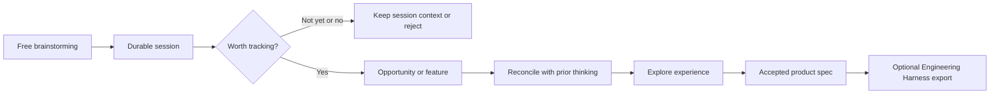
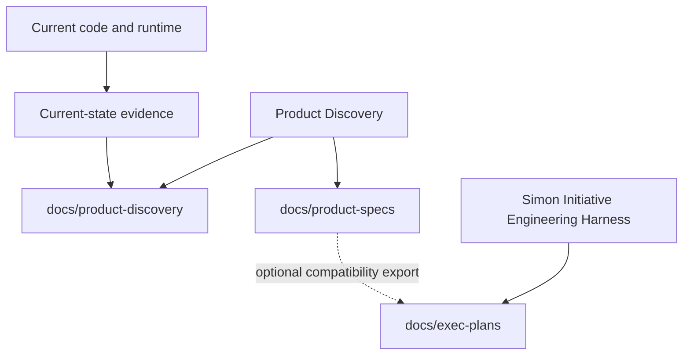

# Product Discovery Harness

**English** · [Español](README.es.md)

Product Discovery Harness helps you turn messy product thinking into durable,
connected decisions. You can brainstorm freely with an agent, but the useful
parts of the conversation persist in your target repository as sessions,
opportunities, features, decisions, product specs, and reviewable evidence.

It is for answering questions such as: *What are we trying to build? Who is it
for? What should change? What have we already decided? Are we repeating or
contradicting ourselves?*

You are allowed to change your mind. The harness helps you do it consciously:
it preserves what changed, what overlaps, what was rejected, and why.

> **Recommended companion:** use this harness to define **what** and **why** to
> build. When a feature is ready, use the [Simon Initiative Engineering
> Harness](https://github.com/Simon-Initiative/harness) to analyze, design,
> plan, implement, and verify **how** to build it. The integration is optional;
> this repository never requires or modifies that harness.

## Read this first: skills versus commands

`$product-*` names are **conversational skills**: invoke them with your agent
inside a target repository. They are not shell commands.

`product-harness ...` names are **local CLI commands** used by skills and by
you for deterministic operations such as bootstrapping, validation, landscape,
and reconciliation.

```text
# Ask your agent
$product-talk
$product-reconcile <record-id>

# Run in a terminal
product-harness landscape .
product-harness validate .
```

## The mental model



Free thoughts do not get their own `IDEA-*` IDs. They belong in session
summaries. Promote a thought only when it deserves durable attention:

- **Opportunity (`OPP-xxx`)**: a user situation, problem, and desired outcome.
- **Feature (`FEATURE-xxx`)**: an accepted, concrete product direction.
- **Decision (`DEC-xxx`)**: an explicitly accepted product choice.
- **Current capability (`CURRENT-xxx`)**: observed evidence of what exists now.

The harness keeps these truth layers distinct:



Code is evidence of current behavior; it is not automatically the future
product specification. Accepted product docs express intended future behavior.
When they differ, reconcile the discrepancy instead of silently choosing one.

## Install once, then use it in many repositories

Installing the harness puts one Git checkout on your machine and links its
skills into your agent's skills directory. It does **not** copy the harness into
each product repository.

```bash
curl -fsSL https://raw.githubusercontent.com/nicocirio/product-discovery-harness/main/install.sh | bash
```

This installs the tagged `stable` channel in
`~/.local/share/product-discovery-harness`, links skills under an owned
`product-discovery-harness` namespace in `~/.agents/skills` and/or
`~/.claude/skills`, and exposes the checkout-local `product-harness` CLI.

Use `latest` when you deliberately want the default branch instead of the newest
tag:

```bash
curl -fsSL https://raw.githubusercontent.com/nicocirio/product-discovery-harness/main/install.sh | bash -s -- latest
```

From a local checkout, run `./bin/product-harness-install latest` instead.

```bash
./bin/product-harness-update       # fetch selected channel and repair links
./bin/product-harness-status       # checkout, channel, version, and broken links
```

Requirements: Git, Bash, Python 3.10+, and network access on the first install
to create the checkout-local Python runtime. Override
`PRODUCT_HARNESS_REPO_URL` or `PRODUCT_HARNESS_REPO_PATH` for a fork or custom
checkout. To uninstall, remove only the owned namespace marked
`.product-harness-install-root` and optionally the checkout.

## Release a new harness version (maintainers)

Releases are manual for now. From a clean, reviewed `main` checkout:

```bash
make test
make validate
git diff --check
# Update version.json, pyproject.toml, and CHANGELOG.md for vX.Y.Z.
git add version.json pyproject.toml CHANGELOG.md
git commit -m "Release vX.Y.Z"
git tag -a vX.Y.Z -m "Release vX.Y.Z"
git push origin main --follow-tags
```

Do not create the tag if a gate fails. `stable` installs the newest release
tag; `latest` follows the default branch and is for users who intentionally
want untagged changes. After the repository is public, add the remote install
smoke test recorded in the tech-debt tracker.

## Bootstrap each target repository

After installing once, enter the repository where you want to define a product:

```text
$product-bootstrap --mode=auto
$product-talk
```

Bootstrap creates the target's durable product-discovery context. It does not
install skills, modify application code, or require Engineering Harness.

## Start here: tell the harness what is on your mind

You do not need to choose the right skill before you start. Begin with
`$product-talk` and describe the situation in ordinary language. The
facilitator clarifies the problem, keeps a concise session, and recommends the
next useful focus when one becomes clear. It never silently promotes an idea or
makes a product decision for you.

The specialist skills are there when you want to go deeper. They are not a
checklist you must complete.

## Your first ten minutes

### A new product

```text
$product-bootstrap --mode=greenfield
$product-talk
```

The facilitator reads the new repository context, asks one useful question, and
helps decide what deserves durable attention. For example:

```text
What situation or motivation made you want this product to exist?
```

### An existing product

```text
$product-bootstrap --mode=brownfield
$product-audit
$product-review-current-state
$product-talk
```

Audit reconstructs a provisional view of the current product from repository
evidence. It refreshes `current-state/` and preserves each run in
`docs/product-discovery/audits/`. Review the latest evidence with the owner
before treating it as an accepted baseline.

## A worked example: appointment booking

Imagine you run a small salon and say:

```text
$product-talk

“I want customers to book appointments without messaging us, and I want fewer
missed appointments.”
```

The facilitator should not jump to a feature. It can first ask whether fewer
messages, fewer missed appointments, or a clearer staff schedule is the most
important outcome. If you agree that one problem deserves tracking, the harness
assigns the identifier; you do not invent it:

```text
Created opportunity:
OPP-001 — Reduce missed appointments

Next suggested focus: learn when and why appointments are missed.
```

When you return later, find records by title instead of memorizing codes:

```text
$product-landscape

Active opportunities:
- OPP-001 — Reduce missed appointments
  Exploring · Last reviewed: 12 days ago
```

Only now does an ID-taking skill become useful:

```text
$product-opportunity-explore OPP-001
```

> **About IDs:** the harness assigns `OPP-*`, `FEATURE-*`, and `DEC-*` IDs
> when an idea becomes a durable record. Run `$product-landscape` whenever you
> need to find one again.

## Choose the depth that fits the decision

There is no mandatory pipeline. Start with `$product-talk`; use a deeper path
only when the unanswered question calls for it.

| If you need to answer… | The next kind of work is… | A specialist skill, when you want it explicitly |
| --- | --- | --- |
| “What is actually painful, for whom, and how often?” | Understand the opportunity | `$product-opportunity-explore OPP-001` |
| “There are several meaningfully different ways this could work. Which should we choose?” | Compare interaction models | `$product-experience-explore OPP-001`, then `$product-experience-evaluate OPP-001` |
| “We chose a direction. What product promise and boundaries are we committing to?” | Make it a feature candidate | `$product-feature-crystallize OPP-001` |
| “This is already clear and low-risk.” | Keep the conversation short; ask the facilitator whether a feature candidate is ready | `$product-talk` |

For the salon, exploring experience is useful only if the booking model is a
real decision: customers might choose an open slot, request a slot for staff
confirmation, or receive proposed times. If that decision is already clear,
do not run an exploration merely because the skill exists.

Return at any time with `$product-resume`. It reads repository-local context and
suggests the next highest-leverage conversation or specialized skill.

## What the durable files mean

| If you want to know… | Read… |
| --- | --- |
| How are product ideas progressing? | `docs/product-discovery/PRODUCT_LANDSCAPE.md` |
| Which ideas overlap or need alignment? | `docs/product-discovery/CONSISTENCY_REPORT.md` |
| What is unresolved? | `docs/product-discovery/STATUS.md` and `open-questions.md` |
| What was decided or rejected? | `docs/product-discovery/decisions/` |
| What product feature is canonical? | `docs/product-specs/` |
| What currently exists? | `docs/product-discovery/current-state/` |
| What is engineering doing? | `docs/exec-plans/`, when Engineering Harness is used |

Product Discovery Harness owns `product-discovery/`, `product-specs/`,
`PRODUCT_SENSE.md`, and `EXPERIENCE_SENSE.md`. Engineering workflows own
`exec-plans/` and technical documentation. The only boundary is an optional,
marked `informal.md` export; it never overwrites unmarked engineering work.

## Skill reference

Use this only when you want direct control. `$product-talk` and
`$product-resume` are the normal starting points.

| Intent | Skills | What they are for |
| --- | --- | --- |
| Set up or re-enter | `$product-bootstrap`, `$product-resume`, `$product-landscape` | Establish context, return after time away, or find durable records by title. |
| Think and stay coherent | `$product-talk`, `$product-focus`, `$product-synthesize`, `$product-reconcile`, `$product-review` | Explore a topic, deepen it, consolidate sessions, surface overlap, or review the portfolio. |
| Understand an existing product | `$product-audit`, `$product-review-current-state` | Build and accept a current-state baseline before proposing change. |
| Shape a product direction | `$product-opportunity-map`, `$product-opportunity-explore`, `$product-experience-north`, `$product-experience-explore`, `$product-experience-evaluate`, `$product-feature-crystallize` | Move from an outcome to a selected experience direction and, only then, a feature candidate. |
| Prepare execution | `$product-slice`, `$product-handoff`, `$product-validate` | Define outcome-oriented releases, write the canonical product spec, and check the contract. |

Individual skill files under [`skills/`](skills/) contain the full operational
protocol. The table is a routing guide, not a replacement for them.

## Useful output examples

These are illustrative outputs. They show the kind of guidance to expect; your
IDs, wording, and files come from your target repository.

### A facilitated conversation

```text
Current understanding:
You want customers to book without messaging, while reducing missed appointments.

Question:
Which outcome matters most in the next month: fewer messages, fewer no-shows,
or a schedule staff can trust?
```

### A product landscape

```text
Product landscape updated:
- Records: 7
- Require review: 2
- Missing detail documents: 1

Needs attention:
- OPP-001 — Reduce missed appointments
  Exploring — Review needed: continue discovery
  Last reviewed: 12 days ago
```

An old record is a review signal, not an automatic reason to reject it.

### A reconciliation prompt

```text
Possible overlap:
- OPP-001 overlaps FEATURE-002
  Rationale: both address how customers confirm and remember appointments.

Question:
Should OPP-001 extend FEATURE-002, remain distinct, or replace it?
```

The agent may identify a possible conflict, but it cannot silently merge,
supersede, reject, or accept a record. Those are owner decisions.

### A handoff

```text
Canonical product spec created:
docs/product-specs/guided-attention-queue.md

Engineering export:
Not created. Request --export-engineering when you want compatibility export.
```

The canonical product spec works without Engineering Harness. If you explicitly
request an export, the recommended next step is:

```text
$harness-analyze docs/exec-plans/current/<epic>/<feature>
```

## Using Simon Initiative Engineering Harness

The [Simon Initiative Engineering Harness](https://github.com/Simon-Initiative/harness)
is a natural next step after product definition:

```text
Product Discovery Harness
  defines users, outcomes, experience, scope, and product decisions

Simon Initiative Engineering Harness
  analyzes, designs, plans, implements, reviews, and verifies the change
```

Product handoff is deliberately optional. `$product-handoff` creates the
canonical `docs/product-specs/<feature>.md` first. Use
`--export-engineering` only when you want a public compatibility file under
`docs/exec-plans/`. It never edits PRDs, FDDs, plans, designs, execution
records, or other engineering artifacts.

## Local commands and validation

```bash
product-harness bootstrap . --mode=auto
product-harness detect .
product-harness landscape .
product-harness reconcile . --record OPP-001
product-harness validate .

make test
make validate
```

`product-harness validate` checks target structure, config, IDs, lifecycle,
relations, paths, dates, and references. It does not make product decisions.

## Safety, boundaries, and FAQ

**Does the harness discard old ideas?** No. It marks them for review. You decide
to revisit, defer, supersede, or reject them.

**Does it turn every brainstorm into a record?** No. Free thoughts live in
sessions. Only meaningful, promoted thoughts become opportunities or features.

**Do docs or code win?** They answer different questions. Code/runtime evidence
describes what exists now. Accepted product docs describe intended future
behavior. A mismatch is a discrepancy to reconcile.

**Can the agent decide for me?** It can challenge, organize, and propose. It
cannot silently accept a product decision or resolve a relationship.

**Does it modify application code or private systems?** No. Brownfield audit is
read-only outside discovery documentation. No private-network access is needed.

**Do I need Engineering Harness?** No. It is an optional companion. Product
Discovery Harness remains useful from brainstorming through canonical specs.

## Developing this repository

```bash
python3 -m venv .venv
.venv/bin/pip install -e '.[dev]'
make test
make validate
```

Versioning lives in `version.json`; user-facing changes belong in
`CHANGELOG.md`. To uninstall globally installed skills, remove only namespaces
marked `.product-harness-install-root` and optionally the installed checkout.
